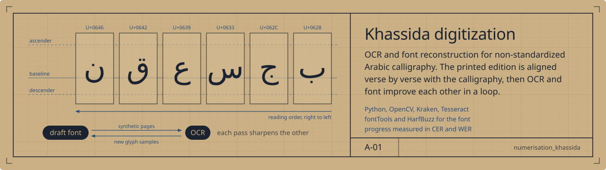
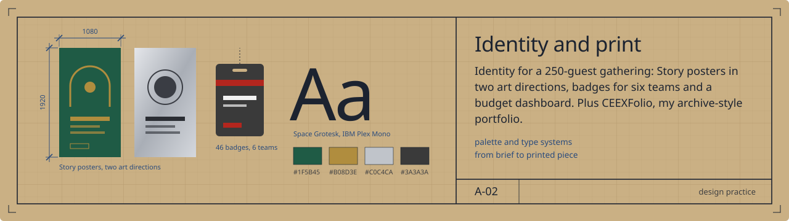
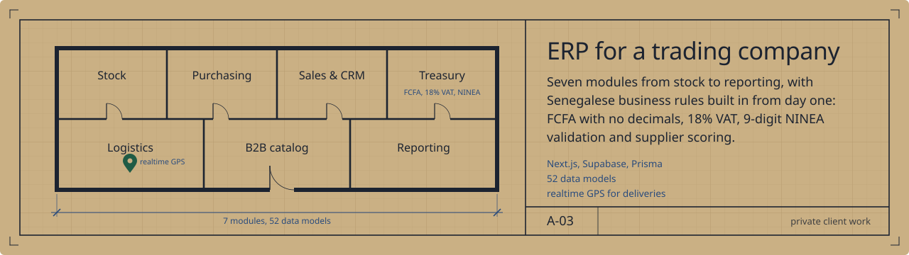
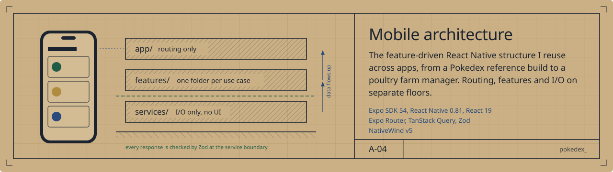

  

I'm a graphic designer who builds, and an engineer who designs. Based in Dakar, Senegal, I work across identity, interfaces and systems, and I care as much about the grid of a poster as about the schema of a database. Everything I make starts as a drawing before it becomes code.

## Drawing set

**Khassida digitization.** OCR and font reconstruction for non-standardized Arabic calligraphy. The printed edition is aligned verse by verse with the calligraphy, then OCR and font improve each other in a loop. Python, OpenCV, Kraken, Tesseract, fontTools, HarfBuzz.
[Open the repository](https://github.com/cheikhMohamedD/numerisation_khassida)

**Identity and print.** Visual identity for a 250-guest gathering: Story posters in two art directions (Touba green and brass, metallic silver), badges for six teams and a budget dashboard. Plus CEEXFolio, my archive-style portfolio.

**ERP for a trading company.** Seven modules, from stock to reporting, with Senegalese business rules built in from day one: FCFA with no decimals, 18% VAT, 9-digit NINEA validation, supplier scoring. Next.js, Supabase, Prisma, 52 data models. Private client work.

**Mobile architecture.** The feature-driven React Native structure I reuse across apps, from a Pokédex reference build to a poultry farm manager. Expo SDK 54, React Native 0.81, Expo Router, TanStack Query, Zod, NativeWind v5.
[Open the reference build](https://github.com/cheikhMohamedD/pokedex_)

## How I work

1. **Observe.** Real workflows and local rules first. The poultry farm app started from a farmer's handwritten notebook.
2. **Draw.** Data model, flows and screens on paper before any code.
3. **Design.** Type, color and grid, so the product has its own voice.
4. **Build.** Ship, measure, then harden. I'm now training in DevSecOps.

## Toolbox

**Design:** Figma, identity systems, typography, print production <!-- ajoutez vos outils : Illustrator, Photoshop... -->
**Build:** TypeScript, Next.js, React Native with Expo, Node.js, PostgreSQL, Supabase, Prisma, TanStack Query, Zod, Tailwind and NativeWind
**Research:** Python, OpenCV, Kraken, Tesseract, fontTools
**Learning:** Docker, CI/CD security, Trivy, Checkov, OPA/Gatekeeper

## Contact

[LinkedIn](VOTRE_LIEN_LINKEDIN) / [Portfolio](VOTRE_LIEN_PORTFOLIO) / Studio: Beanie Beard SN

Sheets coded in SVG, set in Space Grotesk and IBM Plex Mono on kraft #CAB084.
